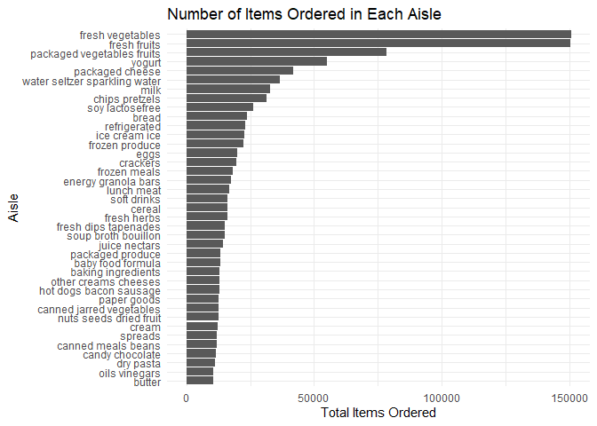

P8105_hw3_cz2750
================
2023-10-14

# Q1

## 1. Dataset Description:

1.  The dataset `instacart` has 1384617 observations and 15 variables.
2.  Variables in the dataset include order_id, product_id,
    add_to_cart_order, reordered, user_id, eval_set, order_number,
    order_dow, order_hour_of_day, days_since_prior_order, product_name,
    aisle_id, department_id, aisle, department.
3.  Key variables: 1). order_id: order identifier 2). add_to_cart_order:
    order in which each product was added to cart 3). reordered: 1 if
    this prodcut has been ordered by this user in the past, 0 otherwise
    4). order_dow: the day of the week on which the order was placed 5).
    product_name: name of the product

## 2. Number of Aisles and which aisles are the most items ordered from

``` r
number <- n_distinct(instacart$aisle)
aisle_counts <- instacart %>%
  group_by(aisle) %>%
  summarise(count = n()) %>%
  arrange(-count) %>%
  slice(1) %>%
  pull(aisle) 
```

1). There are ‘r number’ unique aisles. 2). The most items are ordered
from the ‘aisle_counts’.

## 3. Make a plot that shows the number of items ordered in each aisle, limiting this to aisles with more than 10000 items ordered. Arrange aisles sensibly, and organize your plot so others can read it.

``` r
aisle_counts_filtered <- instacart %>%
  group_by(aisle) %>%
  summarise(count = n()) %>%
  filter(count > 10000) %>%
  arrange(-count)

ggplot(aisle_counts_filtered, aes(x = reorder(aisle, count), y = count)) +
  geom_bar(stat="identity") +
  coord_flip() + 
  labs(title = "Number of Items Ordered in Each Aisle",
       x = "Aisle",
       y = "Total Items Ordered") +
  theme_minimal()
```

<!-- -->

## 4. Make a table showing the three most popular items in each of the aisles “baking ingredients”, “dog food care”, and “packaged vegetables fruits”. Include the number of times each item is ordered in your table.

``` r
popitems <- instacart %>%
  filter(aisle %in% c("baking ingredients", "dog food care", "packaged vegetables fruits")) %>%
  group_by(aisle, product_name) %>%
  summarise(count = n(), .groups = "drop") %>%
  arrange(aisle, -count) %>%
  group_by(aisle) %>%
  slice_head(n = 3)

knitr::kable(popitems,caption = "Top 3 Items in Selected Aisles", align = c('l', 'l', 'r'))
```

| aisle                      | product_name                                  | count |
|:---------------------------|:----------------------------------------------|------:|
| baking ingredients         | Light Brown Sugar                             |   499 |
| baking ingredients         | Pure Baking Soda                              |   387 |
| baking ingredients         | Cane Sugar                                    |   336 |
| dog food care              | Snack Sticks Chicken & Rice Recipe Dog Treats |    30 |
| dog food care              | Organix Chicken & Brown Rice Recipe           |    28 |
| dog food care              | Small Dog Biscuits                            |    26 |
| packaged vegetables fruits | Organic Baby Spinach                          |  9784 |
| packaged vegetables fruits | Organic Raspberries                           |  5546 |
| packaged vegetables fruits | Organic Blueberries                           |  4966 |

Top 3 Items in Selected Aisles

## 5. Make a table showing the mean hour of the day at which Pink Lady Apples and Coffee Ice Cream are ordered on each day of the week; format this table for human readers (i.e. produce a 2 x 7 table).

``` r
prohour <- instacart %>%
  filter(product_name %in% c("Pink Lady Apples", "Coffee Ice Cream")) %>%
  group_by(product_name, order_dow) %>%
  summarise(mean_hour = mean(order_hour_of_day, na.rm = TRUE), .groups = "drop") %>%
  spread(key = order_dow, value = mean_hour) %>%
  select(product_name, `0`, `1`, `2`, `3`, `4`, `5`, `6`) 

knitr::kable(prohour, caption = "Mean Hour of Order by Product and Day of the Week", digits = 2)
```

| product_name     |     0 |     1 |     2 |     3 |     4 |     5 |     6 |
|:-----------------|------:|------:|------:|------:|------:|------:|------:|
| Coffee Ice Cream | 13.77 | 14.32 | 15.38 | 15.32 | 15.22 | 12.26 | 13.83 |
| Pink Lady Apples | 13.44 | 11.36 | 11.70 | 14.25 | 11.55 | 12.78 | 11.94 |

Mean Hour of Order by Product and Day of the Week
