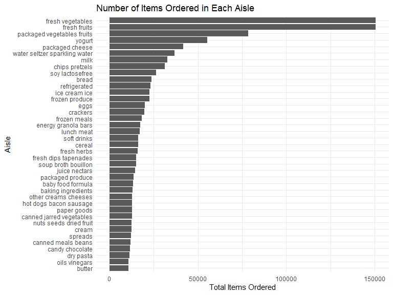
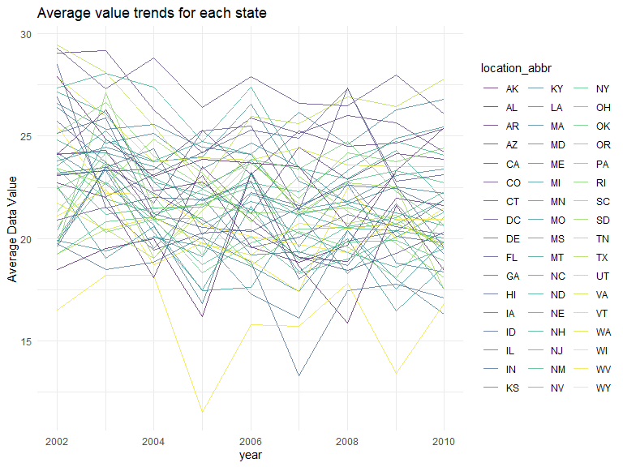
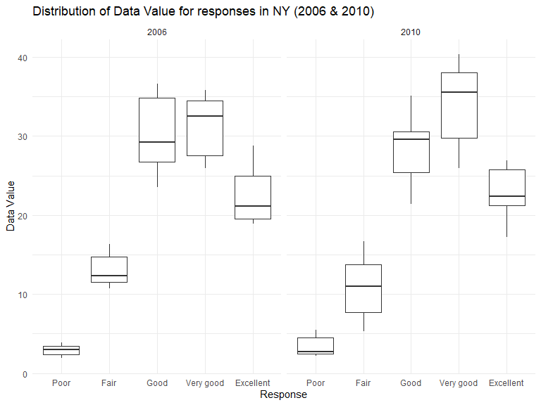
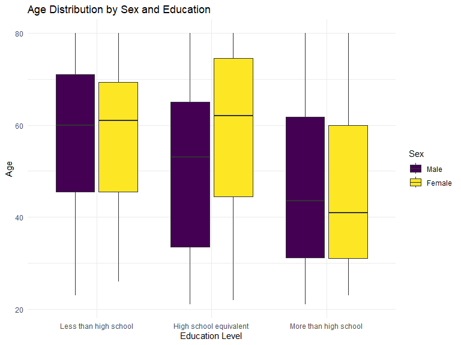
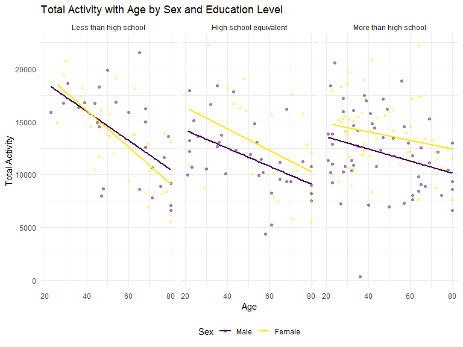
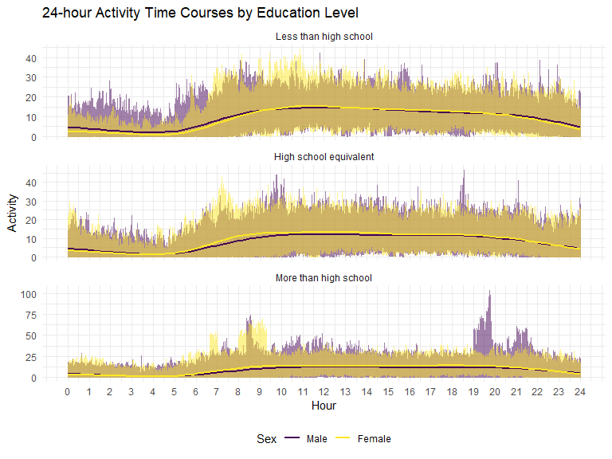

P8105_hw3_cz2750
================
2023-10-14

# Q1

``` r
data("instacart")
```

## 1. Dataset Description:

### 1. The dataset `instacart` has 1384617 observations and 15 variables.

### 2. Variables in the dataset include order_id, product_id, add_to_cart_order, reordered, user_id, eval_set, order_number, order_dow, order_hour_of_day, days_since_prior_order, product_name, aisle_id, department_id, aisle, department.

### 3. Key variables:

#### 1). order_id: order identifier

#### 2). add_to_cart_order: order in which each product was added to cart

#### 3). reordered: 1 if this prodcut has been ordered by this user in the past, 0 otherwise

#### 4). order_dow: the day of the week on which the order was placed

#### 5). product_name: name of the product

## 2. Number of Aisles and which aisles are the most items ordered from

``` r
number <- n_distinct(instacart$aisle)
aisle_counts <- instacart %>%
  group_by(aisle) %>%
  summarise(count = n()) %>%
  arrange(-count) %>%
  slice(1) %>%
  pull(aisle) 
```

### Comment

#### 1). There are ‘r number’ unique aisles.

#### 2). The most items are ordered from the ‘aisle_counts’.

## 3. Make a plot that shows the number of items ordered in each aisle, limiting this to aisles with more than 10000 items ordered. Arrange aisles sensibly, and organize your plot so others can read it.

``` r
aisle_counts_filtered <- instacart %>%
  group_by(aisle) %>%
  summarise(count = n()) %>%
  filter(count > 10000) %>%
  arrange(-count)

ggplot(aisle_counts_filtered, aes(x = reorder(aisle, count), y = count)) +
  geom_bar(stat="identity") +
  coord_flip() + 
  labs(title = "Number of Items Ordered in Each Aisle",
       x = "Aisle",
       y = "Total Items Ordered") +
  theme_minimal()
```



## 4. Make a table showing the three most popular items in each of the aisles “baking ingredients”, “dog food care”, and “packaged vegetables fruits”. Include the number of times each item is ordered in your table.

``` r
popitems <- instacart %>%
  filter(aisle %in% c("baking ingredients", "dog food care", "packaged vegetables fruits")) %>%
  group_by(aisle, product_name) %>%
  summarise(count = n(), .groups = "drop") %>%
  arrange(aisle, -count) %>%
  group_by(aisle) %>%
  slice_head(n = 3)

knitr::kable(popitems,caption = "Top 3 Items in Selected Aisles", align = c('l', 'l', 'r'))
```

| aisle                      | product_name                                  | count |
|:---------------------------|:----------------------------------------------|------:|
| baking ingredients         | Light Brown Sugar                             |   499 |
| baking ingredients         | Pure Baking Soda                              |   387 |
| baking ingredients         | Cane Sugar                                    |   336 |
| dog food care              | Snack Sticks Chicken & Rice Recipe Dog Treats |    30 |
| dog food care              | Organix Chicken & Brown Rice Recipe           |    28 |
| dog food care              | Small Dog Biscuits                            |    26 |
| packaged vegetables fruits | Organic Baby Spinach                          |  9784 |
| packaged vegetables fruits | Organic Raspberries                           |  5546 |
| packaged vegetables fruits | Organic Blueberries                           |  4966 |

Top 3 Items in Selected Aisles

## 5. Make a table showing the mean hour of the day at which Pink Lady Apples and Coffee Ice Cream are ordered on each day of the week; format this table for human readers (i.e. produce a 2 x 7 table).

``` r
prohour <- instacart %>%
  filter(product_name %in% c("Pink Lady Apples", "Coffee Ice Cream")) %>%
  group_by(product_name, order_dow) %>%
  summarise(mean_hour = mean(order_hour_of_day, na.rm = TRUE), .groups = "drop") %>%
  spread(key = order_dow, value = mean_hour) %>%
  select(product_name, `0`, `1`, `2`, `3`, `4`, `5`, `6`) 

knitr::kable(prohour, caption = "Mean Hour of Order by Product and Day of the Week", digits = 2)
```

| product_name     |     0 |     1 |     2 |     3 |     4 |     5 |     6 |
|:-----------------|------:|------:|------:|------:|------:|------:|------:|
| Coffee Ice Cream | 13.77 | 14.32 | 15.38 | 15.32 | 15.22 | 12.26 | 13.83 |
| Pink Lady Apples | 13.44 | 11.36 | 11.70 | 14.25 | 11.55 | 12.78 | 11.94 |

Mean Hour of Order by Product and Day of the Week

# Q2

``` r
data("brfss_smart2010")
```

## 1. Data Cleaning

``` r
colnames(brfss_smart2010)
```

    ##  [1] "Year"                       "Locationabbr"              
    ##  [3] "Locationdesc"               "Class"                     
    ##  [5] "Topic"                      "Question"                  
    ##  [7] "Response"                   "Sample_Size"               
    ##  [9] "Data_value"                 "Confidence_limit_Low"      
    ## [11] "Confidence_limit_High"      "Display_order"             
    ## [13] "Data_value_unit"            "Data_value_type"           
    ## [15] "Data_Value_Footnote_Symbol" "Data_Value_Footnote"       
    ## [17] "DataSource"                 "ClassId"                   
    ## [19] "TopicId"                    "LocationID"                
    ## [21] "QuestionID"                 "RESPID"                    
    ## [23] "GeoLocation"

``` r
brfss_smart2010 <- brfss_smart2010 %>%
  rename(
    class_id = ClassId,
    data_source = DataSource,
    geo_location = GeoLocation,
    location_abbr = Locationabbr,
    location_desc = Locationdesc,
    location_id = LocationID,
    question_id = QuestionID,
    resp_id = RESPID,
    topic_id = TopicId,
  ) %>%
    janitor::clean_names() %>%
  filter(topic == "Overall Health",
         response %in% c("Excellent", "Very good", "Good", "Fair", "Poor")) %>%
  mutate(response = factor(response, 
                           levels = c("Poor", "Fair", "Good", "Very good", "Excellent"),
                           ordered = TRUE))
```

## 2. States Observed at 7 or More Locations in 2002 and 2010

``` r
states <- brfss_smart2010 %>%
  filter(year %in% c(2002, 2010)) %>%
  group_by(year, location_abbr) %>%
  summarise(num_entries = n_distinct(location_desc)) %>%
  filter(num_entries >= 7)
```

    ## `summarise()` has grouped output by 'year'. You can override using the
    ## `.groups` argument.

``` r
states_2002 <- states %>%
  filter(year == 2002)  %>%
  pull(location_abbr)

states_2010 <- states %>%
  filter(year == 2010) %>%
  pull(location_abbr)
```

### Comment

#### 1). In 2002, states observed at 7 or more locations were CT, FL, MA, NC, NJ, PA.

#### 2). In 2010, states observed at 7 or more locations were CA, CO, FL, MA, MD, NC, NE, NJ, NY, OH, PA, SC, TX, WA.

## 3. Construct a dataset and create a Spaghetti Plot for Excellent Responses

``` r
excellent_responses <- brfss_smart2010 %>%
  filter(response == "Excellent") %>%
  group_by(year, location_abbr) %>%
  summarise(avg_data_value = round(mean(data_value, na.rm = TRUE),2))
```

    ## `summarise()` has grouped output by 'year'. You can override using the
    ## `.groups` argument.

``` r
ggplot(excellent_responses, aes(x = year, y = avg_data_value, group = location_abbr)) +
  geom_line(aes(color = location_abbr), alpha = 0.7) +
  labs(title = "Average value trends for each state",
       y = "Average Data Value") +
  theme_minimal() 
```


\### Comment \#### 1). The plot depicts the trends of “Excellent”
responses over time, averaged across locations within each state. \####
2). There is a dense overlap of lines around the 20-25 cutoff,
suggesting that many states have averages of “excellent” responses in
this range in different years.

## 4. Two-Panel Plot for Distribution of Data Values in NY State (2006 and 2010)

``` r
ny_data <- brfss_smart2010 %>%
  filter(year %in% c(2006, 2010) & location_abbr == "NY")

ggplot(ny_data, aes(x = response, y = data_value)) +
  geom_boxplot() +
  facet_wrap(~ year, ncol = 2) +
  labs(title = "Distribution of Data Value for responses in NY (2006 & 2010)",
       y = "Data Value",
       x = "Response") +
  theme_minimal()
```


\### Comment \#### 1). The plot shows the health perceptions of New York
State residents by county in 2006 and 2010. \#### 2). While there are
variations between counties, the overall distribution seems to be
somewhat consistent over the two years.

# Q3

## 1. Data Loading, Cleaning and Tidying

``` r
nhanes_accel <- read_csv("nhanes_accel.csv")  %>%
  janitor::clean_names()
```

    ## Rows: 250 Columns: 1441
    ## ── Column specification ────────────────────────────────────────────────────────
    ## Delimiter: ","
    ## dbl (1441): SEQN, min1, min2, min3, min4, min5, min6, min7, min8, min9, min1...
    ## 
    ## ℹ Use `spec()` to retrieve the full column specification for this data.
    ## ℹ Specify the column types or set `show_col_types = FALSE` to quiet this message.

``` r
nhanes_covar <- read_csv("nhanes_covar.csv") %>%
  janitor::clean_names()
```

    ## New names:
    ## Rows: 254 Columns: 5
    ## ── Column specification
    ## ──────────────────────────────────────────────────────── Delimiter: "," chr
    ## (5): ...1, 1 = male, ...3, ...4, 1 = Less than high school
    ## ℹ Use `spec()` to retrieve the full column specification for this data. ℹ
    ## Specify the column types or set `show_col_types = FALSE` to quiet this message.
    ## • `` -> `...1`
    ## • `` -> `...3`
    ## • `` -> `...4`

``` r
nhanes_covar <- nhanes_covar[-c(1:4),] 
colnames(nhanes_covar) <- c("seqn", "sex", "age", "bmi", "education")
nhanes_covar$seqn <- as.integer(nhanes_covar$seqn)
nhanes_covar$age <- as.numeric(nhanes_covar$age)
nhanes_covar$bmi <- as.numeric(nhanes_covar$bmi)

nhanes_accel$seqn <- as.integer(nhanes_accel$seqn)
```

## 2. Data filtering and Merging

``` r
nhanes_covar <- nhanes_covar %>% 
  filter(age >= 21, !is.na(sex), !is.na(age), !is.na(bmi), !is.na(education))

nhanes <- inner_join(nhanes_covar, nhanes_accel, by = "seqn")
```

## 3. Encode data

``` r
nhanes$sex <- factor(nhanes$sex, levels = c("1", "2"), 
                          labels = c("Male", "Female"))

nhanes$education <- factor(nhanes$education, 
                               levels = c("1", "2", "3"), 
                               labels = c("Less than high school", 
                                          "High school equivalent", 
                                          "More than high school"))
```

## 4. Reader-Friendly Table

``` r
table_gender_education <- table(nhanes$sex, nhanes$education)

kable(table_gender_education, caption = "Number of Men and Women in Each Education Category")
```

|        | Less than high school | High school equivalent | More than high school |
|:-------|----------------------:|-----------------------:|----------------------:|
| Male   |                    27 |                     35 |                    56 |
| Female |                    28 |                     23 |                    59 |

Number of Men and Women in Each Education Category

### Comment

#### 1). There is a balanced distribution of males and females with different levels of education in the dataset.

#### 2). More males(35) than females(23) have an education equivalent to high school.

#### 3). Contrary to article 2, females (59) outnumber males (56) in terms of education levels beyond high school.

## 5. Visualization of the age distributions

``` r
ggplot(nhanes, aes(x = education, y = age, fill = sex)) +
  geom_boxplot() +
  labs(title = "Age Distribution by Sex and Education",
       x = "Education Level",
       y = "Age",
       fill = "Sex") +
  theme_minimal()
```


\### Comment \#### 1). The group with a education level high school
equivalent has a wider age range. \#### 2). The group with the largest
gap in age distribution between male and female is the group with a
education level of high school equivalent.

## 6. Create a total activity variable for each participant & Plotting

``` r
nhanes$total <- rowSums(nhanes[, grep("^min", names(nhanes))])

ggplot(nhanes, aes(x = age, y = total, color = sex)) +
  geom_point(aes(shape = sex), alpha = 0.5) + 
  geom_smooth(method = "lm", se = FALSE) + 
  facet_wrap(~ education) + 
  labs(title = "Total Activity with Age by Sex and Education Level",
       x = "Age",
       y = "Total Activity",
       color = "Sex",
       shape = "Sex") 
```

    ## `geom_smooth()` using formula = 'y ~ x'


\### Comment \#### 1). The trend consistent across education levels.
\#### 2). The highest total activity for both males and females was in
the group with an educational level less than high school. \#### 3). In
both groups, with the exception of the group with an education level
less than high school, women always had more total activity than men at
the same age.

## 7. Make a three-panel plot that shows the 24-hour activity time courses for each education level and use color to indicate sex.

``` r
nhanes_panel <-nhanes %>%
  pivot_longer(cols = starts_with("min"), 
               names_to = "minute", 
               values_to = "activity") %>%
  mutate(minute = as.integer(gsub("min", "", minute)))

ggplot(nhanes_panel, aes(x = minute, y = activity, color = sex)) +
  geom_line(alpha = 0.5) +
  geom_smooth(se = FALSE) +
  facet_wrap(~ education, scales = "free_y", ncol = 1) +
  scale_x_continuous(name = "Hour", breaks = seq(0, 1440, 60), labels = 0:24) +
  labs(title = "24-hour Activity Time Courses by Education Level",
       y = "Activity",
       color = "Sex") 
```

    ## `geom_smooth()` using method = 'gam' and formula = 'y ~ s(x, bs = "cs")'



### Comment

#### 1). There are almost no gender differences in the activity patterns of the three educational groups.

#### 2). All three groups were more active from about 9am to 8pm.
